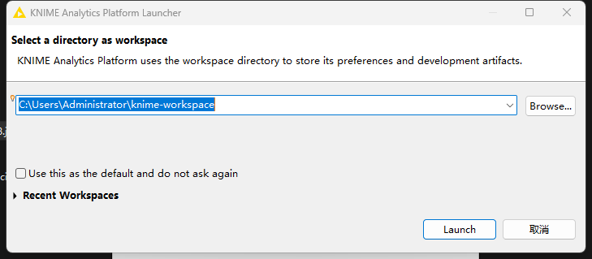
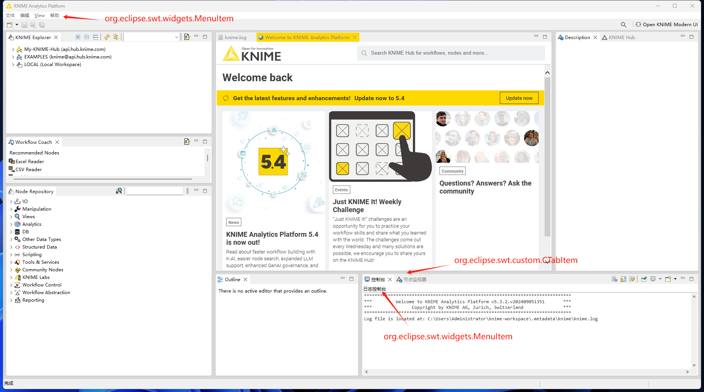

### 配置分为三个优先级
1. 第一优先级：`组件类名`
2. 第二优先级：`任意通配：*`
3. 第三优先级：`otherwise`

### 参考配置文件内容
```yaml
# 2级优先级
"*":
 "&View": 视图

# 最后优先级
otherwise:
  "&Edit": 编辑

# 等级优先级
org:
  eclipse:
    swt:
      widgets:
        Label:
          "KNIME Console": 日志控制台
        Button:
          "Cancel": 取消
        # 菜单
        MenuItem:
          "&File": 文件
          "&Help": 帮助
      custom:
        CTabItem:
          Console: 控制台
          "Node Monitor": 节点监视器
```

`取消` 按钮是 `org.eclipse.swt.widgets.Button` 的实例
